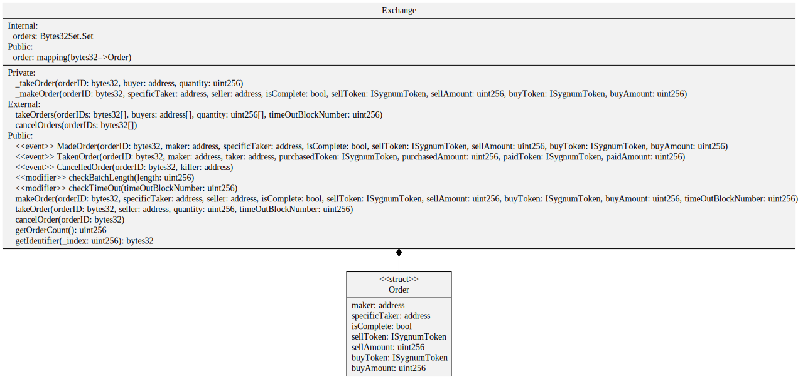

[Mirrored from our internal VCS @ commit hash 4246d5895f5412b9e42283cbab4ebf2dec388ffb]
# Solidity-DEX-Contracts

**Secure Decentralized Exchange Smart Contracts compliant with OTF regulation**

Built on a solid foundation of community-vetted code, utilizing [OpenZeppelin industry standards](https://github.com/OpenZeppelin/openzeppelin-contracts).

 * [Exchange](contracts/dex/Exchange.sol) is built according to the specifications required by regulation for an OTF (or *Organised Trading Facility*) where financial products can be traded by whitelisted market participants in a discretionary fashion, using an on-chain order book.
 * Comes with a [Trading Pair Whitelist](https://gitlab.com/sygnum/blockchain-engineering/ethereum/solidity-base-contracts/-/blob/develop/contracts/helpers/TradingPairWhitelist.sol) which allows to define which token pairs can be traded on the [Exchange](contracts/dex/Exchange.sol).
 * Features a Trader role, using [role-based permissioning](https://gitlab.com/sygnum/blockchain-engineering/ethereum/solidity-base-contracts/-/tree/develop/contracts/role), to operate on behalf of the whitelisted investors.
 * Audited by [Quantstamp](https://quantstamp.com/) with no major vulnerabilities.

## Overview

The Sygnum [Exchange](contracts/dex/Exchange.sol) are a set of smart contracts that enable ERC20 tokens to be traded in a fully on-chain and peer-to-peer fashion. The contracts have been designed to serve as a secondary marketplace for security tokens, modelled after the requirements for an OTF. With its integrated role-based model it is convenient to use for the operation of a marketplace in a regulated environment, for example by making sure that only whitelisted participants can place trades and only registered addresses have the permission to intervene (e.g. in case of an emergency to ensure orderly trading). Trading via [Exchange](contracts/dex/Exchange.sol) occurs through an on-chain order book, where orders can either be placed, executed, or cancelled. Order aggregation and/or matching logic can be built off-chain to interact with the contract and provide a seamless user experience.

The operator of the [Exchange](contracts/dex/Exchange.sol) is offered meaningful ways to administrate the marketplace. Besides managing the list of eligible trading pairs, the market can be paused and trading pairs can be frozen. It is also possible to make use of a specific role ([Trader](ethereum/solidity-base-contracts/contracts/role/trader)) which is allowed to trade on behalf market participants. This enables to operate the secondary market with a brokerage-style service offering.

### Functions

An oververiew of the most important functions of the [Exchange](contracts/dex/Exchange.sol) can be found below.

`makeOrder`: place an order on the [Exchange](contracts/dex/Exchange.sol) for a specific trading pair, adding this order to the order book. It is possible to specify a `specificTaker`, ensuring that only this address can fill the order. It can also be defined whether this order can be partially filled or not. This can be useful in order to settle OTC trades through [Exchange](contracts/dex/Exchange.sol).

`takeOrder`: accept an order from the order book, specifying the quantity to fill (if the `makeOrder` is partially executable). Alternatively, `takeOrders` can be used to accept multiple orders in one transaction. This can be called for example if a matching algorithm is used.

`cancelOrder`: remove an order from the order book. Alternatively, `cancelOrders` can be used to cancel multiple orders in one transaction.

All functions can only be called by whitelisted participants.


#### Rationale for an on-chain order book

There are multiple options for a target operating model (TOM) of a secondary market on the Ethereum blockchain. On the one hand there are order book-based exchanges that operate similar to what we know from the traditional world, where buy and sell limit orders are accounted for in a central order book. Usually, this is accompanied by a matching engine which executes trades among competing bids and asks at the same price. On the other hand, there are newer approaches based on liquidity pools, which have popped up recently in the DeFi space in the form of automated market maker (AMM) protocols, such as [Uniswap](https://uniswap.org/) or [Balancer](https://balancer.finance/).

However, such AMM protocols are relatively new and unproven especially from a regulatory standpoint. This is why the Sygnum Exchange contracts have been designed to support an order book-based marketplace. The next question which arises is whether this order book should be on-chain or off-chain. While operating off-chain reduces transaction costs and latency, an on-chain setup offers a lot of benefits especially in terms of interoperability and security, besides being transparent and open. At Sygnum we are strong believers in public blockchains and run operations on-chain wherever it makes sense.


### Installation

Note: for now this repo only works with NodeJS 10.

Obtain a [gitlab access token](https://docs.gitlab.com/ee/user/profile/personal_access_tokens.html). Using the `api` scope should suffice.

```console
# Set URL for your scoped packages.
# For example package with name `@sygnum/solidity-dex-contracts` will use this URL for download
npm config set @sygnum:registry https://gitlab.com/api/v4/packages/npm/

# Add the token for the scoped packages URL. This will allow you to download
# `@sygnum/` packages from private projects.
npm config set '//gitlab.com/api/v4/packages/npm/:_authToken' "<your_access_token>"
```

Now you are able to install all the dependencies as well as the private npm packages within the @sygnum gitlab org.
```console
npm i
```

### Usage

[Here you can find the DEX contract](contracts/dex/Excahnge.sol).
If you need to edit and import from the [Sygnum base library](https://gitlab.com/sygnum/blockchain-engineering/ethereum/solidity-base-contracts) you can simply import them as:

```solidity
pragma solidity 0.5.12;

import "@sygnum/solidity-base-contracts/contracts/role/BaseOperators.sol";

contract MyContract is BaseOperators {
    constructor() public {
    }
}
```

To keep your system secure, you should **always** use the installed code as-is, and neither copy-paste it from online sources, nor modify it yourself. The library is designed so that only the contracts and functions you use are deployed, so you don't need to worry about it needlessly increasing gas costs.

### Testing

First, install all required packages:  
`npm install`  

Then run:
`npm test`


### Migrations

Migrations are based on Truffle migrations, see the `migrations` folder. There is also a `manual` folder inside `migrations` which contains helpful scripts intended only for use by developers. These can help when performing updates on DEV or TST environments, but are not intended for production use.

## Contracts Architecture

This project contains the following contracts:

#### Decentralized Exchange
- [ISygnumToken.sol](contracts/ISygnumToken.sol):
> Standard ERC20 Interface with additional features designed by Sygnum for access control and in particular block/unblock operations used by admin accounts in order to prevent an unauthorized user withdrawal.

- [DEX](contracts/dex/Exchange.sol):
> Full Decentralized Exchange contract consisting of functions to generate (*makeOrder*), fill (*takeOrder*) or cancel (*cancelOrder*) an order for a trade of a listed pair of ERC20 tokens between two respective whitelisted investors. Additional access control features allows an outstanding trader of the platform to execute orders on behalf of users.




## Security

This project is maintained by [Sygnum](https://www.sygnum.com/), and developed following our high standards for code quality and security. We take no responsibility for your implementation decisions and any security problems you might experience.

The latest audit was done on November 2020 at commit hash cb83109.

Please report any security issues you find to team3301@sygnum.com.
